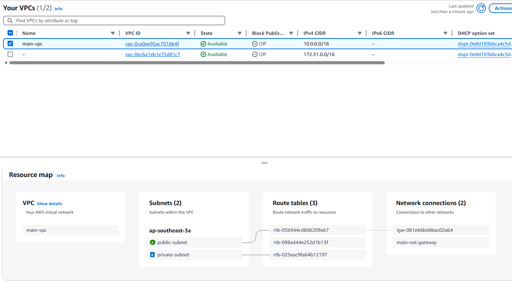

# PROBLEM 1 Results screenshoot:

full terraform plan [log](./dpay-iac/outs.log) : 

## Write Terraform HCL config to generate AWS infra in the following form:

A. 1 VPC

B. 1 public subnet
### Results-Problem 1 point A,B:

---
C. 1 private subnet connected to 1 NAT Gateway
### Results-Problem 1 point C:

---

D. 1 autoscaling group with config:

    a. minimum 2 EC2 t2.medium instances and max 5 instances,
    b. where scaling policy is CPU >= 45%.
    c. instances must be placed on the 1 private subnet created in point C above.

### Results-Problem 1 point D:
a. minimum 2 EC2 t2.medium instances and max 5 instances,

b. where scaling policy is CPU >= 45%.

c. instances must be placed on the 1 private subnet created in point C above.

---

E. Automatically creates CloudWatch monitoring for instance and resource created:

    a. CPU monitoring
    b. memory usage
    c. status check failure
    d. network usage

### Results-Problem 1 point E:

---
